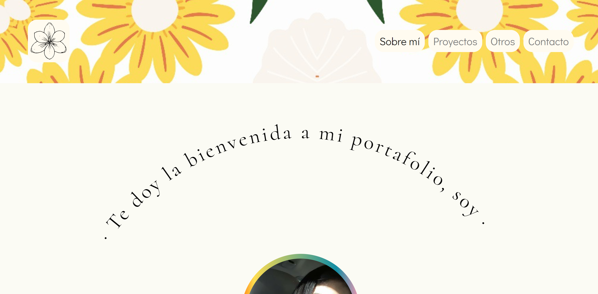
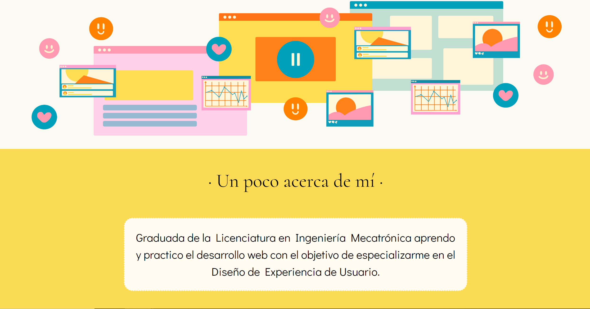
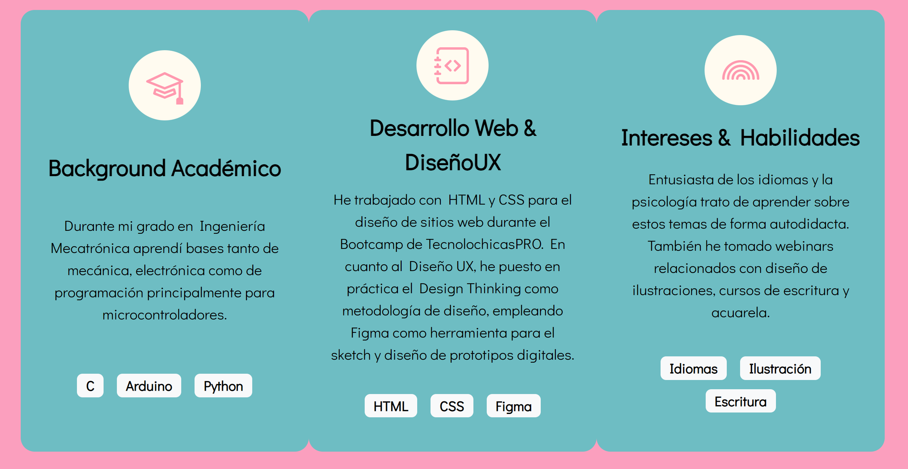
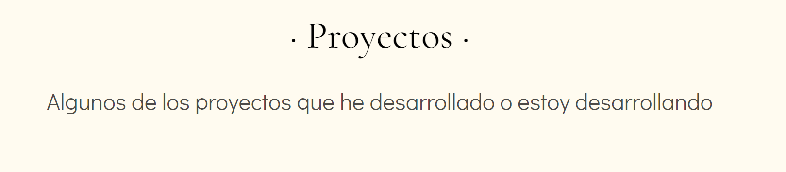
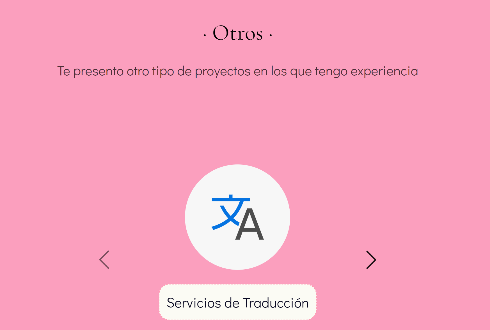
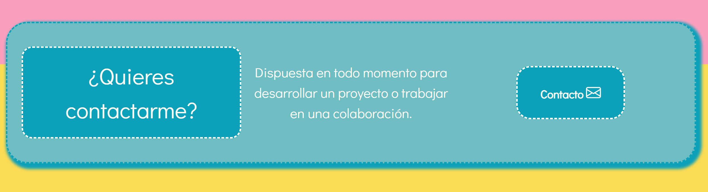

# Portafolio Personal - Personal Portfolio

## Español

* Descripción
* Objetivo
* Estructura
* Tecnologías y atribuciones

### Descripción

Portafolio que contiene los proyectos que he realizado y la experiencia relacionada al desarrollo web. Debido a esto, se estará actualizando continuamente y no es un producto consumado, sin embargo es totalmente funcional. 

Este portafolio inició como parte final del Bootcamp de TecnolochicasPRO México, por lo que está basado en el proyecto creado por Nancy Salazar [Portafolio Adaptable (Responsive) con Bootstrap 5](https://github.com/nancynsalazar/tecnolochicaspro_portafolio) .

### Objetivo

Mostrar la experiencia y los proyectos realizados presentándolos mediante un sitio web. 

### Estructura

El portafolio está constituido por cuatro secciones principales:

* Sobre mí
* Proyectos
* Otros
* Contacto

Se planea incluir una sección de Testimonios pronto. 

#### Sobre mí 

Explica mi motivación personal y experiencia.

#### Proyectos 

Muestra proyectos desarrollados y en desarrollo.

#### Otros

Incluye otras áreas en las que me desarrollo profesionalmente.

#### Contacto

Despliega mis canales y formas de contacto.

### Tecnologías y atribuciones

#### Tecnologías

Para la creación de esta página se hizo uso de:

* HTML
* CSS
* JavaScript 
* Bootstrap 5

Se incluyeron **Google Fonts** y **Bootstrap icons** para personalización de fuentes e incorporación de íconos.

#### Atribuciones 

Atribuciones con respecto a imágenes de libre uso.

[Autor en Pixabay k_notgeil](https://pixabay.com/es/photos/antecedentes-resumen-patr%c3%b3n-6101097/)

[Autor en Pixabay inspire_studio](https://pixabay.com/es/vectors/traducir-traducci%c3%b3n-idioma-6641970/)

[Autor en Freepik @rawpixel.com](https://www.freepik.es/vector-gratis/vector-fondo-pequena-empresa-diseno-plano_16264729.htm#page=6&query=svg%20retro%20web&position=5&from_view=search&track=robertav1_2_sidr)

